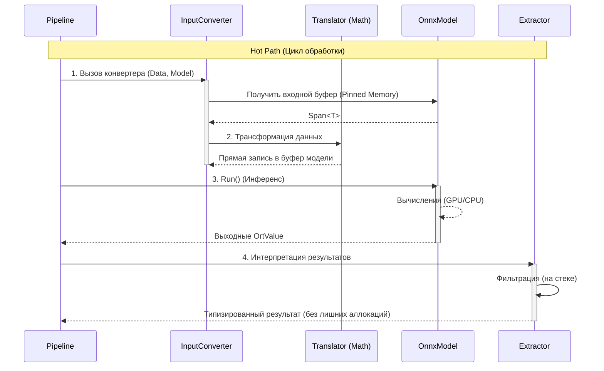

# Архитектура NeuroModFlowNet.ONNX

Библиотека спроектирована как высокопроизводительная обертка над ONNX Runtime, ориентированная на задачи компьютерного зрения реального времени.

Ключевые архитектурные принципы:
- **Zero-Allocation**: Исключение выделения памяти в цикле обработки (Hot Path).
- **Zero-Copy**: Минимизация или полное исключение копирования данных между этапами.
- **Hot Path Optimization**: Вынос всей логики принятия решений на этап инициализации.

---

## Основные компоненты системы

Архитектура строится вокруг четырех ключевых слоев, каждый из которых имеет четкую зону ответственности.

### 1. OnnxModel (Ядро)
Центральный координатор жизненного цикла модели.

*   **Управление ресурсами**: Загрузка `.onnx` файлов, инициализация `InferenceSession` и настройка вычислительных провайдеров (TensorRT, CUDA, CPU).
*   **Управление памятью (Memory Management)**:
    *   *Pre-allocated Buffers*: Модель владеет заранее выделенными буферами для входных и выходных тензоров, что устраняет накладные расходы на аллокацию в каждом кадре.
    *   *Zero-copy Linking*: Поддержка создания `OrtValue`, ссылающихся напрямую на внешнюю память (например, буфер захвата видео), если формат данных совпадает.
*   **Самодокументирование**: Автоматическое считывание метаданных модели (имена слоев, размерности, типы данных) для валидации пайплайна.

### 2. Converters (Входной шлюз)
Слой конвертации, связывающий пользовательские данные с тензорами модели. Реализует паттерн, разделяющий логику выбора алгоритма и само исполнение.

В простых случаях (когда формат данных уже совпадает с требованиями модели) конвертер может напрямую ссылаться на память исходных данных (zero-copy). 
В более сложных случаях он выполняет трансформацию данных, используя оптимизированные трансляторы.

*   **Cold Path (Подготовка)**:
    На этапе инициализации `ConverterBuilder` анализирует типы данных и конфигурацию. Происходит выбор оптимальной стратегии трансляции (вручную или через *AutoTune*) и "запекание" её в делегат.
*   **Hot Path (Исполнение)**:
    В основном цикле используется готовый делегат `InputConverter`. Он не содержит условных переходов (`if/switch`) и выполняет прямую запись данных в память модели.
*   **Type Safety**: Строгая типизация через Generics (`TIn`, `TOut`) предотвращает ошибки несоответствия форматов данных на этапе компиляции.

### 3. Translators (Математическое ядро)
Набор низкоуровневых функций для трансформации данных (например, `List<Mat> -> Span<float>`).

*   **Изоляция**: Чистые функции, не зависящие от контекста ONNX.
*   **Производительность**:
    *   *Unsafe*: Прямая работа с указателями для обхода проверок границ массивов.
    *   *SIMD & Unrolling*: Использование векторных инструкций и развертки циклов.
    *   *Inlining*: Агрессивное встраивание кода для минимизации накладных расходов вызова.
*   **Функциональность**: Нормализация, перестановка каналов (HWC -> CHW), конвертация типов (FP32 -> FP16) "на лету".

### 4. Extractors (Выходной шлюз)
Компоненты для интерпретации сырых выходных тензоров в доменные объекты (например, Bounding Box).

*   **Direct Layout Mapping**: Структуры C# спроектированы в точном соответствии с бинарным форматом тензоров, что позволяет читать данные без парсинга.
*   **Lazy Access**: Чтение полей объекта происходит только после прохождения фильтров (например, по `Confidence`), что экономит такты CPU.
*   **Zero-Overhead**: Использование стека (`stackalloc`) для временных вычислений и копирование финальных результатов единым блоком памяти.

---

## Поток данных (Data Flow)

Процесс обработки одного кадра (Hot Path) выглядит следующим образом:

/Gemini generated/

## Резюме

Архитектура разделяет ответственность между компонентами для достижения максимальной эффективности:

1.  **Converters** — знают "Где" и "Куда".
2.  **Translators** — знают "Как" (математика), не обязательно.
3.  **OnnxModel** — предоставляет ресурсы.
4.  **Extractors** — придают смысл выходным байтам.

Такой подход позволяет легко расширять систему новыми форматами данных и моделями, 
 сохраняя экстремальную производительность инференса.
