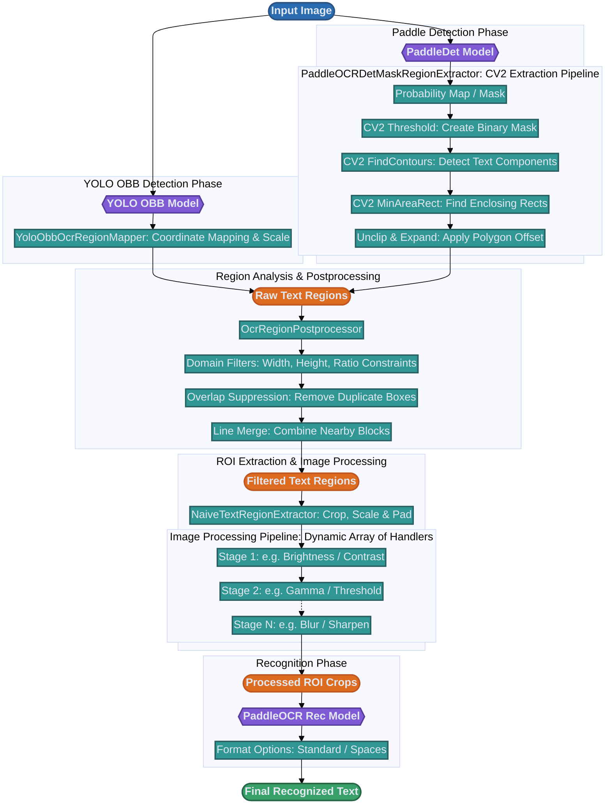

# OCR Data Flow

This diagram illustrates the top-down data flow from an input image to the final recognized text.

> [!TIP]
> **Layout Controls:**
> - **Spacing:** Tune `rankSpacing` (vertical) and `nodeSpacing` (horizontal) in the `%%{init: ...}%%` block.
> - **No-Wrap:** Handled by `white-space: nowrap` in `classDef` statements to keep text inline.
> - **Class Widths:** To style groups of nodes, add `min-width: 200px;` directly into the `classDef` definitions.
> - **Individual Styling:** You can override style for an individual node by adding a `style` declaration anywhere in the diagram:
>   ```mermaid
>   style B1 width:250px,height:45px;
>   ```


