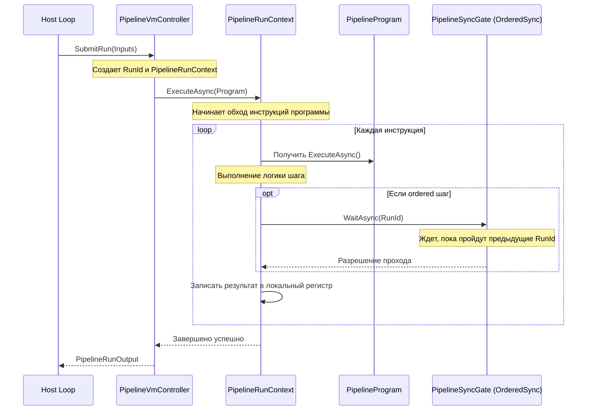

# Кластеры классов NeuroModFlowNet.Pipeline

## Глоссарий (Термины и понятия)

Для понимания архитектуры Pipeline важно знать, как используются ключевые термины в рамках этой библиотеки:

1.  **Виртуальная машина (VM / `PipelineVmController`)** — изолированная среда выполнения. Она принимает на вход данные от хоста, оборачивает их в контекст запуска и последовательно прогоняет по шагам программы.
2.  **Программа (`PipelineProgram`)** — статический, неизменяемый сценарий (список инструкций), описывающий логику пайплайна от чтения данных до выдачи результатов.
3.  **Инструкция (`IPipelineInstruction`)** — атомарный шаг программы (например: запуск YOLO, кроп изображения, вызов OCR или запись в лог).
4.  **Контекст запуска (`PipelineRunContext`)** — контекст выполнения одного конкретного запроса (обычно — одного кадра). Имеет свой изолированный набор локальных переменных (регистров) и живет строго во время выполнения одной программы для одного `RunId`.
5.  **`RunId`** — монотонно возрастающий порядковый номер запуска/контекста (1, 2, 3...). Используется для синхронизации и упорядочивания результатов вместо номеров кадров, так как кадры на хосте могут отбрасываться или идти не по порядку.
6.  **Шлюз (`PipelineSyncGate`)** — точка синхронизации в программе. Приостанавливает выполнение запуска и пропускает его дальше только тогда, когда все предыдущие контексты (с меньшими `RunId`) уже прошли эту точку. Это нужно, например, для последовательного обновления трекера.
7.  **Граф координат (`CoordinateTransformGraph`)** — реестр преобразований геометрии кадра (кропы, изменения размера, повороты). Каждая операция регистрирует свое преобразование, что позволяет в конце пайплайна пересчитать координаты найденного текста или объектов обратно к исходному кадру.

---

## 1. Ядро выполнения (Execution VM Engine)
Управляет жизненным циклом и запусками виртуальной машины (VM).

*   **[PipelineVmController](file:///c:/GitKOE/NeuroModFlowNet.ONNX/src/NeuroModFlowNet.Pipeline/Execution/PipelineVmController.cs)** — "сердце" VM.
    *   *Прием запросов и запуск:* принимает входные данные от хост-системы, оборачивает их в контекст и запускает в фоновом потоке.
    *   *Контроль параллелизма:* ограничивает число одновременно обрабатываемых кадров в системе (`MaxInFlight`).
    *   *Управление остановкой:* обеспечивает корректную отмену и дожидается завершения всех активных задач при выключении.
*   **[PipelineRunLedger](file:///c:/GitKOE/NeuroModFlowNet.ONNX/src/NeuroModFlowNet.Pipeline/Execution/PipelineRunLedger.cs)** — журнал учета запусков.
    *   *Учет состояния:* регистрирует каждый принятый `RunId`, отслеживая его фазы жизни (`Created`, `Running`, `Success`, `Failed`).
    *   *Сохранение результатов:* хранит выходные данные и сведения об ошибках каждого прохода.
*   **[PipelineRunInputs](file:///c:/GitKOE/NeuroModFlowNet.ONNX/src/NeuroModFlowNet.Pipeline/Execution/PipelineRunInputs.cs)** / **[PipelineRunOutput](file:///c:/GitKOE/NeuroModFlowNet.ONNX/src/NeuroModFlowNet.Pipeline/Execution/PipelineRunOutput.cs)** — контейнеры аргументов входа и результатов выхода.
*   **[PipelineRunHandle](file:///c:/GitKOE/NeuroModFlowNet.ONNX/src/NeuroModFlowNet.Pipeline/Execution/PipelineRunHandle.cs)** — асинхронный дескриптор для ожидания завершения конкретной задачи хостом.
*   **[PipelineRunStatus](file:///c:/GitKOE/NeuroModFlowNet.ONNX/src/NeuroModFlowNet.Pipeline/Execution/PipelineRunStatus.cs)** — перечисление фаз жизни запуска (`Created`, `Running`, `Success`, `Failed`, `Cancelled`).

---

## 2. Программа и Инструкции (Program & Instructions)
Декларативное описание логики конвейера и ее пошаговое выполнение.

*   **[IPipelineInstruction](file:///c:/GitKOE/NeuroModFlowNet.ONNX/src/NeuroModFlowNet.Pipeline/Instructions/IPipelineInstruction.cs)** — базовый контракт шага.
    *   *Выполнение логики:* метод `ExecuteAsync(PipelineRunContext)` выполняет целевое действие над контекстом.
*   **[PipelineProgram](file:///c:/GitKOE/NeuroModFlowNet.ONNX/src/NeuroModFlowNet.Pipeline/Instructions/PipelineProgram.cs)** — неизменяемый плоский массив инструкций.
    *   *Управление циклом:* последовательно вызывает шаги программы, обрабатывая условные переходы (`Jump`), остановки (`Stop`) или ошибки (`Fail`).
    *   *Интеграция отладки:* перед выполнением шага запрашивает отладочный шлюз (`DebugGate`) для поддержки точек останова.
*   **[PipelineProgramBuilder](file:///c:/GitKOE/NeuroModFlowNet.ONNX/src/NeuroModFlowNet.Pipeline/Instructions/PipelineProgramBuilder.cs)** — Fluent API для декларативной сборки программы.
*   **[OrderedSyncInstruction](file:///c:/GitKOE/NeuroModFlowNet.ONNX/src/NeuroModFlowNet.Pipeline/Instructions/OrderedSyncInstruction.cs)** — шаг упорядоченной синхронизации.
    *   *Ожидание очереди:* блокирует выполнение текущей транзакции до тех пор, пока шлюз не разрешит проход (по порядку `RunId`).
*   **[BranchIfInstruction](file:///c:/GitKOE/NeuroModFlowNet.ONNX/src/NeuroModFlowNet.Pipeline/Instructions/BranchIfInstruction.cs)** / **[ConditionalPipelineInstruction](file:///c:/GitKOE/NeuroModFlowNet.ONNX/src/NeuroModFlowNet.Pipeline/Instructions/ConditionalPipelineInstruction.cs)** — условные переходы и ветвление.
*   **[DelegatePipelineInstruction](file:///c:/GitKOE/NeuroModFlowNet.ONNX/src/NeuroModFlowNet.Pipeline/Instructions/DelegatePipelineInstruction.cs)** — выполнение произвольных C#-лямбд в качестве шага программы.

---

## 3. Контекст запуска (Run Context)
Локальный контекст одного запуска (одного `RunId`).

*   **[PipelineRunContext](file:///c:/GitKOE/NeuroModFlowNet.ONNX/src/NeuroModFlowNet.Pipeline/Contexts/PipelineRunContext.cs)** — изолированное рабочее пространство запуска.
    *   *Хранение регистров (локальных переменных):* методы `Get / Set` для переноса промежуточных результатов (кадров, тензоров) между инструкциями.
    *   *Управление временем жизни ресурсов:* метод `AddOwnedResource` регистрирует временные объекты (например, `OrtValue`, `Mat`), гарантируя их освобождение (`Dispose`) в конце запуска (в т.ч. при сбое).
    *   *Локальный граф координат:* отслеживает геометрические изменения кадра в рамках текущего прохода.
    *   *Сбор трассировки:* измеряет время работы инструкций и делает снимки переменных для диагностики.

---

## 4. Память и Общие Ресурсы (Memory & Resources)
Глобальные данные и долгоживущие объекты, разделяемые между всеми контекстами.

*   **[PipelineGlobalMemory](file:///c:/GitKOE/NeuroModFlowNet.ONNX/src/NeuroModFlowNet.Pipeline/Memory/PipelineGlobalMemory.cs)** — общая память VM.
    *   *Общий стейт:* хранит долгоживущие объекты (например, трекеры объектов, счетчики), разделяемые между параллельными запусками.
    *   *Реестр ресурсов:* хранит тяжелые инфраструктурные объекты (сессии ONNX), которые должны жить все время работы контроллера и очищаться только при закрытии VM.

---

## 5. Синхронизация потоков (Synchronization)
Обеспечение корректной последовательности обработки в параллельной среде.

*   **[PipelineSyncGate](file:///c:/GitKOE/NeuroModFlowNet.ONNX/src/NeuroModFlowNet.Pipeline/Synchronization/PipelineSyncGate.cs)** — барьер синхронизации.
    *   *Упорядочивание потоков:* заставляет потоки проходить через него строго по порядку `RunId` (предотвращает обгон кадров в трекере).
    *   *Устойчивость к сбоям:* автоматически пропускает ожидания, если один из предыдущих `RunId` завершился аварией.
*   **[PipelineSyncGateRegistry](file:///c:/GitKOE/NeuroModFlowNet.ONNX/src/NeuroModFlowNet.Pipeline/Synchronization/PipelineSyncGateRegistry.cs)** — реестр всех шлюзов VM.

---

## 6. Преобразование координат (Coordinates)
Построение цепочек пересчета координат для CV-пайплайнов.

*   **[CoordinateTransformGraph](file:///c:/GitKOE/NeuroModFlowNet.ONNX/src/NeuroModFlowNet.Pipeline/Coordinates/CoordinateTransformGraph.cs)** — направленный граф преобразований геометрии.
    *   *Построение истории трансформаций:* связывает цепочку операций (например, `Original -> Crop -> Resized`).
    *   *Проекция координат назад:* вычисляет обратный путь трансформации, позволяя наложить координаты детекции (например, OCR текст) обратно на исходный Full-HD кадр.
*   **[ICoordinateTransform](file:///c:/GitKOE/NeuroModFlowNet.ONNX/src/NeuroModFlowNet.Pipeline/Coordinates/ICoordinateTransform.cs)** — ребро графа трансформации, выполняющее непосредственную проекцию точек вперед и назад.

---

## 7. Диагностика и Отладка (Diagnostics & Debugging)
Сбор телеметрии и контроль переноса данных CPU <-> GPU.

*   **[PipelineRunTrace](file:///c:/GitKOE/NeuroModFlowNet.ONNX/src/NeuroModFlowNet.Pipeline/Diagnostics/PipelineRunTrace.cs)** — снимок выполнения (время шагов, аллокации, логи).
*   **[PipelineVariableDebugInspector](file:///c:/GitKOE/NeuroModFlowNet.ONNX/src/NeuroModFlowNet.Pipeline/Diagnostics/PipelineVariableDebugInspector.cs)** / **[PipelineVariableMemoryLocation](file:///c:/GitKOE/NeuroModFlowNet.ONNX/src/NeuroModFlowNet.Pipeline/Diagnostics/PipelineVariableMemoryLocation.cs)** — инспектор расположения тензоров.
    *   *Мониторинг шины памяти:* определяет местонахождение тензора (CPU, GPU, OrtValue) и его форму без тяжелых конвертаций. Это помогает контролировать отсутствие лишних копирований на CPU на hot path.
*   **[IPipelineInstructionDebugGate](file:///c:/GitKOE/NeuroModFlowNet.ONNX/src/NeuroModFlowNet.Pipeline/Diagnostics/IPipelineInstructionDebugGate.cs)** — точка останова/отладки перед выполнением шага.

---

## Взаимодействие при запуске (Workflow)

